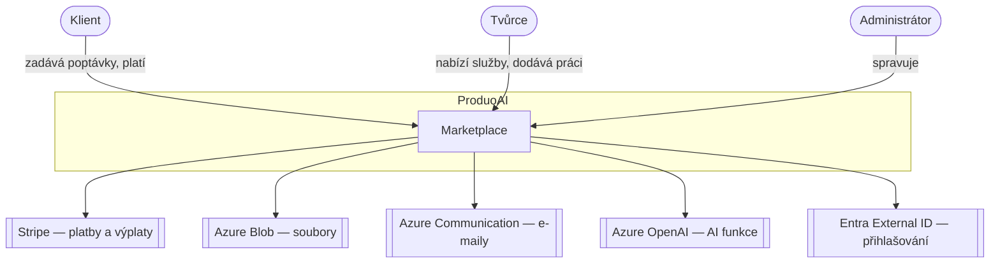
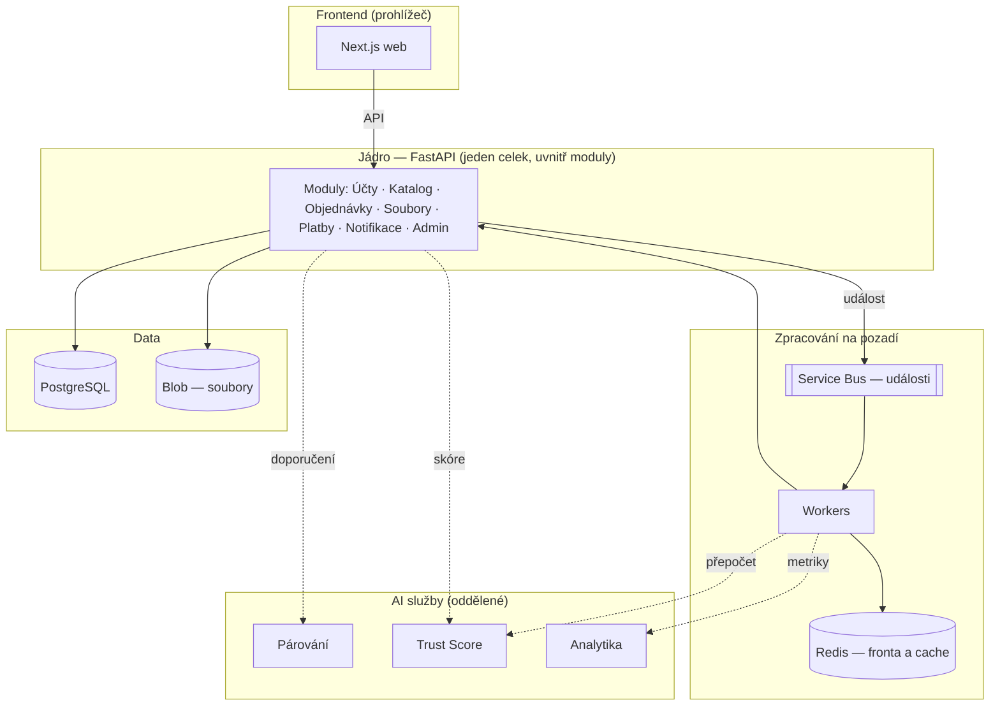
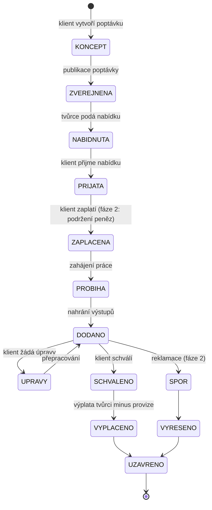
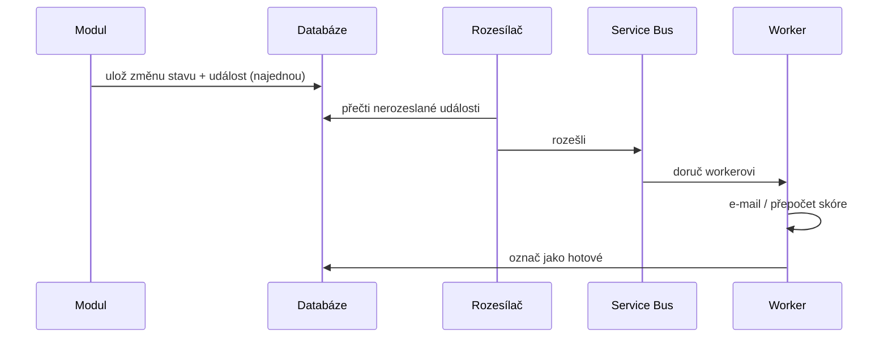

# 01 — Architektura řešení

## 1. Principy návrhu

1. **Přiměřená složitost.** Cílíme na tisíce uživatelů, nikoli miliony. Volíme proto **modulární monolit**: aplikace se nasazuje jako jeden celek, ale uvnitř je rozdělená na oddělené moduly (katalog, objednávky, platby…). Rozdělení na mnoho samostatných služeb (mikroslužby) by v této fázi znamenalo zbytečnou složitost a vyšší náklady.
2. **Oddělené AI funkce.** Chytré funkce (párování, skóre, analytika) běží jako samostatné služby vedle jádra — mají odlišný provozní rytmus (výpočty na pozadí).
3. **Průběh zakázky řízený událostmi.** Při změně stavu objednávky systém vydá „událost", na kterou reagují ostatní části (odešlou e-mail, přepočítají skóre). Části aplikace tak nejsou navzájem těsně provázané.
4. **Vlastní evidence plateb.** Platby fyzicky provádí Stripe, ale každý pohyb peněz si evidujeme také ve vlastním účetním přehledu pro kontrolu a fakturaci.

## 2. Nejvyšší pohled — kdo s aplikací pracuje

## 3. Z čeho se aplikace skládá

## 4. Moduly jádra a jejich odpovědnost

Každý modul má vlastní data a logiku a nepřistupuje přímo k datům jiného modulu — komunikuje přes jeho rozhraní. Aplikace tak zůstává přehledná a v budoucnu ji lze rozdělit.

| Modul | Odpovědnost | Pokryté funkce |
|-------|-------------|----------------|
| Účty a přístup | uživatelé, role, oprávnění, přihlášení | uživatelské účty, role a oprávnění |
| Katalog | služby, nabídky, kategorie, ceníky, vyhledávání | katalog služeb a nabídek |
| Objednávky a průběh | poptávky, nabídky, objednávky, milníky, stavy | zadávání poptávek/objednávek, průběh zakázky |
| Soubory | zadání, podklady, výstupy, verze | nahrávání souborů |
| Platby a fakturace | Stripe, předplatné, provize, evidence, faktury | platby, předplatné, provize, fakturace |
| Notifikace | e-maily a upozornění v aplikaci | notifikační systém |
| Admin | správa entit, moderace, historie akcí | administrace |

## 5. Průběh zakázky

Zakázka prochází jasně danými stavy; každá změna vyvolá událost (např. odeslání e-mailu).

- **ZAPLACENA:** ve fázi 1 běžná platba; ve fázi 2 se peníze podrží (escrow — dok. 05).
- **VYPLACENO:** zde probíhá výplata tvůrci a strhává se provize.
- Každý přechod se zaznamenává do historie (kdo, kdy, z jakého stavu).

## 6. Spolehlivé předávání událostí

Změnu stavu a pokyn „odešli událost" ukládáme do databáze současně, v jednom kroku. Událost se odešle až následně a zpracovává se tak, aby případné opakované doručení nezpůsobilo chybu (např. dvojí odeslání e-mailu). Tím je zajištěno, že se žádná událost neztratí ani nezduplikuje.

## 7. Přiměřenost architektury

| Hledisko | Modulární monolit | Mikroslužby |
|----------|-------------------|-------------|
| Provozní složitost | nízká | vysoká |
| Rychlost realizace MVP | vysoká | nízká |
| Provozní náklady | nižší | vyšší |
| Konzistence dat | snadná | složitá |
| Budoucí rozdělení | zůstává možné | — |

Odděleny jsou pouze AI služby (odlišný provozní rytmus). Jádro zůstává monolitem, dokud jeho rozdělení nevyžádá skutečný nárůst provozu (dok. 08).
