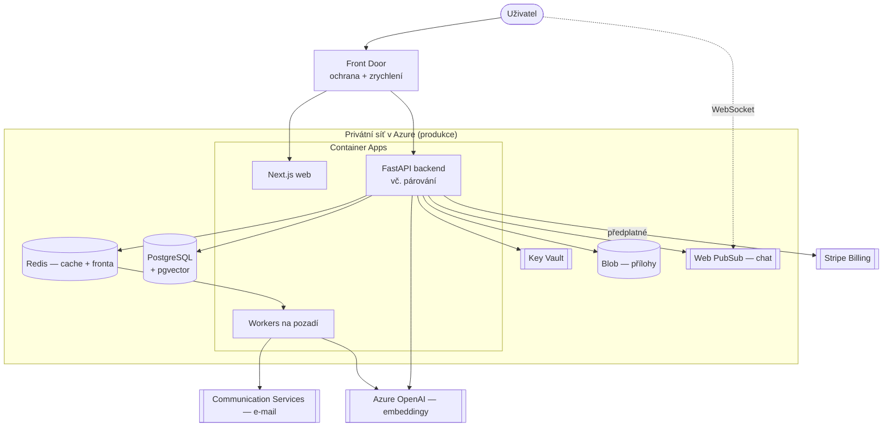

# Plán C — Azure infrastruktura

Připraveno pro: **ProduoAI**

Infrastruktura Plánu C je oproti plné verzi **zjednodušená**, ale zahrnuje **chat mezi klientem a tvůrcem** (real-time přes WebSockets) a **chytré párování** (matching přes embeddingy). Technologický základ (Azure, FastAPI, Next.js, PostgreSQL) je stejný jako u plné verze, takže pozdější rozšíření je doplnění, ne přestavba.

## 1. Rozdíl oproti plné verzi

| Služba (plná verze) | V Plánu C | Poznámka |
|---------------------|:---------:|----------|
| Azure OpenAI (embeddingy pro párování) | ✔ | jen embeddingy pro matching, ne drahé LLM funkce |
| pgvector (vyhledávání podobnosti) | ✔ | potřebné pro párování |
| Web PubSub (WebSockets, real-time) | ✔ | pro **chat** mezi klientem a tvůrcem |
| Samostatné AI služby (analytika) | ✖ | tyto AI moduly Plán C nemá |
| Párování jako samostatná AI služba | ✖ | matching běží uvnitř backendu (FastAPI) |
| Service Bus (sběrnice událostí) | ✖ | úlohy na pozadí (e-maily, přepočet embeddingů) zvládne fronta v Redisu |
| Azure OpenAI pro LLM analytiku / doporučení cen | ✖ | analytická vrstva není součástí Plánu C |

## 2. Region a data v EU

Beze změny: hlavní region v EU (Frankfurt / West Europe), osobní data zůstávají v EU dle GDPR, záložní region pro zálohy.

## 3. Které Azure služby Plán C používá

| Funkce | Azure služba |
|--------|--------------|
| Registrace a přihlášení | Entra External ID |
| Běh aplikací (backend, frontend, workery) | Container Apps + Container Registry |
| Ukládání dat | Database for PostgreSQL — Flexible Server |
| **Chytré párování (embeddingy)** | **Azure OpenAI** (embeddingy) + **pgvector** v PostgreSQL |
| **Chat klient ↔ tvůrce (real-time)** | **Web PubSub** (WebSockets) |
| Nahrávání příloh (brief, portfolio) | Blob Storage |
| Antivirová kontrola souborů (volitelně) | Defender for Storage |
| Fronta úloh na pozadí + cache | Cache for Redis |
| E-mailové notifikace | Communication Services (Email) |
| Vstupní brána + ochrana + zrychlení | Front Door (WAF + CDN) |
| Uložení klíčů | Key Vault |
| Sledování provozu | Monitor + Application Insights + Log Analytics |
| Zálohování | PostgreSQL zálohy + Blob verzování |
| Nasazování | GitHub Actions + Container Registry |

> **Předplatné tvůrců** běží přes **Stripe Billing** (externí služba). Platby za zakázky, výplaty a escrow se v Plánu C neřeší.
>
> **Matching** je vestavěný v backendu: při vytvoření/úpravě profilu, služby nebo poptávky se přes Azure OpenAI spočítá „otisk" (embedding) a uloží do pgvector; při zobrazení doporučení backend vyhledá nejpodobnější a seřadí je. Nevyžaduje samostatnou AI službu.

## 4. Topologie (produkce)

Oproti plné verzi chybí samostatné AI služby (Trust Score, analytika) a Service Bus. Úlohy na pozadí (odeslání e-mailu, přepočet embeddingů) běží přes frontu v **Redisu** a workery. Chat běží přes **Web PubSub** (real-time), zprávy se ukládají do databáze.

Bezpečnostní zásady zůstávají: datové služby jen z privátní sítě, veřejný vstup jen přes Front Door, přihlašování k databázi a klíčům přes spravovanou identitu (bez hesel v kódu).

## 5. Prostředí, nasazování, zálohy

Beze změny oproti plné verzi:
- oddělená prostředí **DEV / TEST / PROD** (bez reálných osobních dat v DEV/TEST),
- automatické nasazování (GitHub Actions), změny databáze bez výpadku, nasazení „na dvakrát",
- sledování provozu, automatické zálohy databáze a souborů, pravidelné zkoušky obnovy.

Podrobný odhad provozních nákladů Plánu C je v dok. 15 (Plán C).
