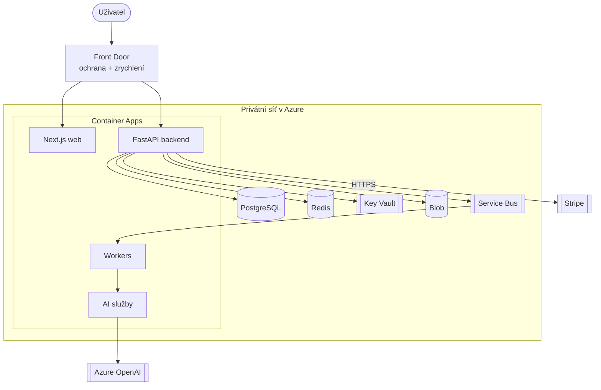
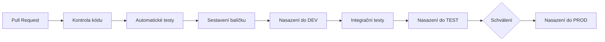

# 03 — Azure infrastruktura

Připraveno pro: **ProduoAI**

## 1. Region a data v EU

- **Hlavní region:** Frankfurt (Germany West Central) nebo Nizozemsko (West Europe) — oba v EU, osobní data tak zůstávají v EU dle GDPR. Konkrétní volba podle dostupnosti Azure OpenAI a odezvy.
- **Záložní region:** druhý EU region pro zálohy.
- Osobní data zůstávají v EU; externí služby musí data zpracovávat v EU nebo mít odpovídající smlouvy (dok. 06).

## 2. Mapování Azure služeb na funkce

| Funkce | Azure služba | Souvislost |
|--------|--------------|------------|
| Registrace a přihlášení | Entra External ID | účty, hesla, ověření e-mailu |
| Běh aplikací (backend, frontend, workery, AI) | Container Apps + Container Registry | aplikace v kontejnerech; Registry je jejich sklad |
| Ukládání dat | Database for PostgreSQL — Flexible Server | hlavní databáze |
| Vyhledávání podobnosti (párování) | PostgreSQL + pgvector | rozšíření téže databáze |
| Nahrávání souborů | Blob Storage | úložiště; přístup přes dočasné odkazy |
| Antivirová kontrola souborů | Defender for Storage | kontrola nahraného souboru |
| Průběh zakázky, notifikace, přepočty | Service Bus + Cache for Redis | Service Bus rozváží události, Redis drží frontu a cache |
| E-maily | Communication Services (Email) | transakční e-maily |
| Živá upozornění | Web PubSub | upozornění v reálném čase |
| Chytré funkce | Azure OpenAI | hotové AI modely (dok. 09b) |
| Vstupní brána + ochrana + zrychlení | Front Door (WAF + CDN) | jediný veřejný vstup, ochrana proti útokům, zrychlení |
| Uložení klíčů a hesel | Key Vault | tajné údaje mimo kód |
| Sledování provozu | Monitor + Application Insights + Log Analytics | logy a metriky, upozornění |
| Zálohování | PostgreSQL zálohy + Blob verzování | automatické zálohy |
| Nasazování | GitHub Actions + Container Registry | automatické testy a nasazení |
| Vyhledávání v katalogu (později) | AI Search | pokročilé fulltext hledání |

## 3. Topologie (produkce)

Bezpečnostní zásady: datové služby (databáze, Redis, Service Bus, Key Vault, soubory) jsou dostupné jen z privátní sítě, nikoli z internetu. Zvenčí lze přistupovat pouze přes Front Door s ochranou proti útokům. Aplikace se k databázi a klíčům přihlašuje přes spravovanou identitu — bez hesel v kódu.

## 4. Oddělená prostředí DEV / TEST / PROD

| Prostředí | Účel | Nastavení |
|-----------|------|-----------|
| DEV | vývoj a průběžné ověřování | menší, testovací režim Stripe |
| TEST (staging) | testování a schvalování | zmenšená kopie produkce |
| PROD | ostrý provoz | výkonné, zálohované, ostrý režim Stripe |

V DEV/TEST se nepoužívají reálná osobní data (kvůli GDPR). Nastavení a klíče se načítají z proměnných a Key Vaultu, nikdy nejsou v kódu.

## 5. Automatické nasazování (CI/CD)

Změny databáze se nasazují po malých krocích bez výpadku; do produkce se nasazuje „na dvakrát" (nová verze naběhne vedle staré a poté se přepne).

## 6. Sledování, zálohování, obnova

- **Sledování:** přehled chyb, odezvy a vytížení; při problému automatické upozornění.
- **Zálohy:** databáze se zálohuje automaticky s možností obnovy k libovolnému okamžiku; soubory mají verze a koš.
- **Zkoušky obnovy:** zálohy se pravidelně nanečisto obnovují.

| Aktivum | Cíl obnovy |
|---------|-----------|
| Databáze | ztráta max ~15 min dat, obnova do ~1 h |
| Soubory | prakticky bez ztráty, obnova do ~1 h |

Podrobný odhad provozních nákladů je v dok. 15.
