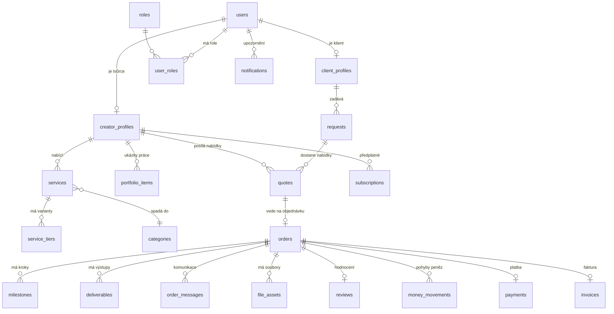

# 04 — Datový model (tabulky v databázi)

Následuje přehled tabulek databáze — co obsahují (včetně datových typů) a jak jsou provázané (vazby).

## 1. Základní pravidla

- Každý řádek má vlastní **ID** (náhodné, typ `UUID`) a časy **kdy vznikl / naposledy změněn** (`TIMESTAMPTZ`).
- Data jsou rozdělená podle modulů (účty, katalog, objednávky, platby…), aby se nepletla dohromady.
- **Pohyby peněz si evidujeme zvlášť** ve vlastní tabulce „pohyby peněz" (interní evidence pohybů peněz) — nikdy nepočítáme zůstatky náhodným dotazem přes objednávky.
- **Osobních dat držíme co nejmíň.** Ověření totožnosti (doklady) drží Stripe, přihlašovací údaje drží Entra — my si držíme jen odkaz na ně.

**Použité datové typy (vysvětlení):**
- `UUID` — náhodný jedinečný identifikátor.
- `TEXT` / `VARCHAR(n)` — text (kratší nebo bez omezení délky).
- `ENUM` — pevný výčet hodnot (např. `client` / `creator` / `admin`). V praxi ho uděláme buď jako typ ENUM, nebo jako `TEXT` s kontrolou povolených hodnot.
- `NUMERIC(12,2)` — desetinné číslo pro peníze (přesné, bez zaokrouhlovacích chyb).
- `INTEGER` — celé číslo.
- `BOOLEAN` — ano/ne.
- `TIMESTAMPTZ` — datum a čas i s časovou zónou.
- `JSONB` — pružné pole pro strukturovaná data (např. seznam dovedností).
- `vector(1536)` — „otisk" textu pro hledání podobnosti (pgvector); 1536 je počet čísel v otisku.

## 2. Přehled tabulek podle modulů

| Modul | Tabulky |
|-------|---------|
| Účty a přístup | `users`, `client_profiles`, `creator_profiles`, `roles`, `user_roles` |
| Katalog | `categories`, `services`, `service_tiers`, `portfolio_items` |
| Objednávky a průběh | `requests`, `quotes`, `orders`, `milestones`, `deliverables`, `order_messages` |
| Soubory | `file_assets` |
| Hodnocení | `reviews` |
| Platby a fakturace | `subscriptions`, `payments`, `money_movements`, `payouts`, `invoices` |
| Notifikace | `notifications`, `notification_preferences` |
| Admin | `audit_log` |
| AI (oddělené, viz dok. 09b) | `creator_match_features`, `trust_scores`, `match_results` |

## 3. Přehledový obrázek (hlavní vazby)

> **Jak číst vazby (kardinalitu):** `1 : N` znamená „k jednomu záznamu patří víc jiných" (např. 1 tvůrce má N služeb). `1 : 0..1` znamená „nepovinně nanejvýš jeden" (např. uživatel *může* mít profil tvůrce). `N : 1` je pohled z druhé strany.

## 4. Tabulky s vysvětlením sloupců, typů a vazeb

### `users` — základní účet
Jeden řádek = jeden člověk (může být zároveň klient i tvůrce).

| Sloupec | Typ | Co to je |
|---------|-----|----------|
| `id` | UUID (PK) | jedinečné ID uživatele |
| `email` | VARCHAR(255) | e-mail (přihlašování řeší Entra, my e-mail držíme pro kontakt) |
| `entra_object_id` | VARCHAR(64) | odkaz na účet v přihlašovací službě Entra |
| `status` | ENUM | stav účtu: `active` / `suspended` / `deleted` |
| `created_at` | TIMESTAMPTZ | kdy se zaregistroval |
| `updated_at` | TIMESTAMPTZ | poslední změna |

**Vazby:** 1 `users` ↔ 0..1 `client_profiles`; 1 `users` ↔ 0..1 `creator_profiles`; 1 `users` ↔ N `user_roles`; 1 `users` ↔ N `notifications`, `audit_log`.

### `creator_profiles` — profil tvůrce

| Sloupec | Typ | Co to je |
|---------|-----|----------|
| `id` | UUID (PK) | ID profilu |
| `user_id` | UUID (FK → users.id) | odkaz na účet |
| `display_name` | VARCHAR(120) | jméno/značka tvůrce |
| `bio` | TEXT | krátký popis |
| `skills` | JSONB | dovednosti a zaměření (seznam štítků) |
| `languages` | JSONB | jazyky, kterými komunikuje |
| `stripe_connect_account_id` | VARCHAR(64) | odkaz na účet u Stripe (kam chodí výplaty) |
| `kyc_status` | ENUM | ověření totožnosti: `pending` / `verified` / `rejected` |
| `rating_avg` | NUMERIC(3,2) | průměrné hodnocení (0–5) |
| `rating_count` | INTEGER | počet hodnocení |
| `completion_rate` | NUMERIC(4,3) | podíl dotažených zakázek (0–1) |
| `on_time_rate` | NUMERIC(4,3) | podíl včas dodaných (0–1) |
| `avg_response_hours` | NUMERIC(6,2) | průměrná rychlost odpovědi v hodinách |
| `capacity_status` | ENUM | `available` / `busy` |
| `embedding` | vector(1536) | „otisk" profilu pro hledání podobnosti (viz dok. 09b) |

**Vazby:** 1 `creator_profiles` ↔ 1 `users`; 1 ↔ N `services`; 1 ↔ N `portfolio_items`; 1 ↔ N `quotes`; 1 ↔ N `subscriptions`; jako `creator_id` vystupuje v N `orders`.
> Sloupce `rating_avg`, `completion_rate`, `on_time_rate`, `avg_response_hours` jsou zároveň vstupem pro **Trust Score** a **párování** (dok. 09b).

### `client_profiles` — profil klienta

| Sloupec | Typ | Co to je |
|---------|-----|----------|
| `id` | UUID (PK) | ID profilu |
| `user_id` | UUID (FK → users.id) | odkaz na účet |
| `company_name` | VARCHAR(160) | firma (nepovinné) |
| `rating_avg` | NUMERIC(3,2) | jak klienta hodnotí tvůrci |
| `rating_count` | INTEGER | počet hodnocení |
| `dispute_count` | INTEGER | kolikrát byl ve sporu |

**Vazby:** 1 `client_profiles` ↔ 1 `users`; 1 ↔ N `requests`; jako `client_id` vystupuje v N `orders`.

### `roles` a `user_roles` — kdo co smí
`roles`

| Sloupec | Typ | Co to je |
|---------|-----|----------|
| `id` | UUID (PK) | ID role |
| `name` | ENUM | `client` / `creator` / `admin` |

`user_roles` (spojovací tabulka — kdo má jakou roli)

| Sloupec | Typ | Co to je |
|---------|-----|----------|
| `user_id` | UUID (FK → users.id) | uživatel |
| `role_id` | UUID (FK → roles.id) | role |

**Vazby:** `users` a `roles` jsou provázané přes `user_roles` vazbou **N : N** (jeden člověk může mít víc rolí, jednu roli má víc lidí).

### `categories` — kategorie služeb (strom)

| Sloupec | Typ | Co to je |
|---------|-----|----------|
| `id` | UUID (PK) | ID kategorie |
| `parent_id` | UUID (FK → categories.id, nullable) | nadřazená kategorie (strom) |
| `name` | VARCHAR(120) | název |
| `slug` | VARCHAR(140) | část URL (hezké adresy, SEO) |

**Vazby:** `categories` ↔ sama sebe (strom přes `parent_id`); 1 `categories` ↔ N `services`.

### `services` — nabídka tvůrce

| Sloupec | Typ | Co to je |
|---------|-----|----------|
| `id` | UUID (PK) | ID služby |
| `creator_id` | UUID (FK → creator_profiles.id) | čí služba |
| `category_id` | UUID (FK → categories.id) | kategorie |
| `title` | VARCHAR(160) | název |
| `description` | TEXT | popis |
| `status` | ENUM | `draft` / `published` / `hidden` |
| `embedding` | vector(1536) | „otisk" služby pro párování |

**Vazby:** N `services` : 1 `creator_profiles`; N : 1 `categories`; 1 `services` ↔ N `service_tiers`.

### `service_tiers` — varianty/balíčky (Basic/Standard/Premium)

| Sloupec | Typ | Co to je |
|---------|-----|----------|
| `id` | UUID (PK) | ID varianty |
| `service_id` | UUID (FK → services.id) | čí varianta |
| `name` | VARCHAR(60) | název balíčku |
| `price` | NUMERIC(12,2) | cena |
| `currency` | CHAR(3) | měna (např. `EUR`, `CZK`) |
| `delivery_days` | INTEGER | za kolik dní dodá |
| `revisions` | INTEGER | kolik úprav je v ceně |

**Vazby:** N `service_tiers` : 1 `services`.

### `portfolio_items` — ukázky práce

| Sloupec | Typ | Co to je |
|---------|-----|----------|
| `id` | UUID (PK) | ID ukázky |
| `creator_id` | UUID (FK → creator_profiles.id) | čí ukázka |
| `title` | VARCHAR(160) | název |
| `description` | TEXT | popis |
| `file_asset_id` | UUID (FK → file_assets.id) | odkaz na soubor/náhled |

**Vazby:** N `portfolio_items` : 1 `creator_profiles`; N : 1 `file_assets`.

### `requests` — poptávka klienta

| Sloupec | Typ | Co to je |
|---------|-----|----------|
| `id` | UUID (PK) | ID poptávky |
| `client_id` | UUID (FK → client_profiles.id) | kdo poptává |
| `title` | VARCHAR(160) | název |
| `brief` | TEXT | zadání |
| `category_id` | UUID (FK → categories.id) | kategorie |
| `budget` | NUMERIC(12,2) | rozpočet |
| `currency` | CHAR(3) | měna |
| `deadline` | TIMESTAMPTZ | termín |
| `status` | ENUM | `draft` / `published` / `closed` |
| `embedding` | vector(1536) | „otisk" zadání pro párování |

**Vazby:** N `requests` : 1 `client_profiles`; N : 1 `categories`; 1 `requests` ↔ N `quotes`.

### `quotes` — nabídka tvůrce na poptávku

| Sloupec | Typ | Co to je |
|---------|-----|----------|
| `id` | UUID (PK) | ID nabídky |
| `request_id` | UUID (FK → requests.id) | na kterou poptávku |
| `creator_id` | UUID (FK → creator_profiles.id) | od koho |
| `price` | NUMERIC(12,2) | nabídnutá cena |
| `currency` | CHAR(3) | měna |
| `delivery_days` | INTEGER | za jak dlouho |
| `message` | TEXT | text nabídky |
| `status` | ENUM | `sent` / `accepted` / `rejected` |

**Vazby:** N `quotes` : 1 `requests`; N : 1 `creator_profiles`; 1 `quotes` ↔ 0..1 `orders` (přijatá nabídka se stane objednávkou).

### `orders` — objednávka (srdce průběhu)

| Sloupec | Typ | Co to je |
|---------|-----|----------|
| `id` | UUID (PK) | ID objednávky |
| `request_id` | UUID (FK → requests.id) | odkaz na poptávku |
| `quote_id` | UUID (FK → quotes.id) | odkaz na přijatou nabídku |
| `client_id` | UUID (FK → client_profiles.id) | kdo objednal |
| `creator_id` | UUID (FK → creator_profiles.id) | kdo dodává |
| `state` | ENUM | stav ze schématu v dok. 01 (`KONCEPT` … `UZAVRENO`) |
| `amount` | NUMERIC(12,2) | částka |
| `currency` | CHAR(3) | měna |
| `commission_rate` | NUMERIC(4,3) | naše provize (podíl 0–1) |
| `stripe_payment_intent_id` | VARCHAR(64) | odkaz na platbu ve Stripe |
| `created_at` | TIMESTAMPTZ | kdy vznikla |

**Vazby:** N `orders` : 1 `client_profiles`, 1 `creator_profiles`, 1 `requests`, 1 `quotes`; 1 `orders` ↔ N `milestones`, N `deliverables`, N `order_messages`, N `file_assets`, N `money_movements`; 1 ↔ 0..1 `payments`, `invoices`, `reviews`.

### `milestones` — kroky/etapy zakázky
Připraveno **už teď** (escrow se zapne ve fázi 2).

| Sloupec | Typ | Co to je |
|---------|-----|----------|
| `id` | UUID (PK) | ID kroku |
| `order_id` | UUID (FK → orders.id) | čí krok |
| `title` | VARCHAR(160) | název kroku |
| `amount` | NUMERIC(12,2) | kolik peněz se na krok váže |
| `status` | ENUM | `pending` / `delivered` / `approved` |
| `due_at` | TIMESTAMPTZ | termín kroku |

**Vazby:** N `milestones` : 1 `orders`.

### `deliverables` — výstupy zakázky

| Sloupec | Typ | Co to je |
|---------|-----|----------|
| `id` | UUID (PK) | ID výstupu |
| `order_id` | UUID (FK → orders.id) | čí výstup |
| `title` | VARCHAR(160) | název |
| `status` | ENUM | `delivered` / `approved` / `revision` |

**Vazby:** N `deliverables` : 1 `orders`; 1 `deliverables` ↔ N `file_assets` (pod výstupem může být víc souborů).

### `order_messages` — komunikace u zakázky

| Sloupec | Typ | Co to je |
|---------|-----|----------|
| `id` | UUID (PK) | ID zprávy |
| `order_id` | UUID (FK → orders.id) | čí zakázka |
| `sender_id` | UUID (FK → users.id) | kdo píše |
| `body` | TEXT | text zprávy |
| `created_at` | TIMESTAMPTZ | kdy |

**Vazby:** N `order_messages` : 1 `orders`; N : 1 `users`.
> Rychlost odpovědí odsud se počítá do `avg_response_hours` (vstup pro Trust Score).

### `file_assets` — soubory

| Sloupec | Typ | Co to je |
|---------|-----|----------|
| `id` | UUID (PK) | ID souboru |
| `order_id` | UUID (FK → orders.id, nullable) | ke které zakázce (nepovinné) |
| `kind` | ENUM | `brief` / `source` / `deliverable` / `preview` |
| `blob_path` | VARCHAR(512) | kde soubor leží v úložišti |
| `version` | INTEGER | verze souboru |
| `scan_result` | ENUM | `clean` / `suspicious` / `pending` |
| `retention_class` | ENUM | jak dlouho ho držíme (kvůli GDPR) |

**Vazby:** N `file_assets` : 0..1 `orders`; na `file_assets` odkazují `portfolio_items` a `deliverables`.

### `reviews` — hodnocení po zakázce

| Sloupec | Typ | Co to je |
|---------|-----|----------|
| `id` | UUID (PK) | ID hodnocení |
| `order_id` | UUID (FK → orders.id) | čí zakázka |
| `author_id` | UUID (FK → users.id) | kdo hodnotí |
| `target_id` | UUID (FK → users.id) | koho hodnotí |
| `rating` | INTEGER (1–5) | známka |
| `comment` | TEXT | text |
| `created_at` | TIMESTAMPTZ | kdy |

**Vazby:** N `reviews` : 1 `orders`; N : 1 `users` (dvakrát — autor a hodnocený). Hodnocení se promítá do `rating_avg`/`rating_count` u profilů.

### `subscriptions` — předplatné tvůrce

| Sloupec | Typ | Co to je |
|---------|-----|----------|
| `id` | UUID (PK) | ID předplatného |
| `creator_id` | UUID (FK → creator_profiles.id) | čí předplatné |
| `plan` | ENUM | `monthly` / `yearly` |
| `status` | ENUM | `active` / `past_due` / `canceled` |
| `stripe_subscription_id` | VARCHAR(64) | odkaz do Stripe |
| `current_period_end` | TIMESTAMPTZ | do kdy je zaplaceno |

**Vazby:** N `subscriptions` : 1 `creator_profiles`.

### `payments` — platba za zakázku

| Sloupec | Typ | Co to je |
|---------|-----|----------|
| `id` | UUID (PK) | ID platby |
| `order_id` | UUID (FK → orders.id) | čí zakázka |
| `amount` | NUMERIC(12,2) | kolik |
| `currency` | CHAR(3) | měna |
| `status` | ENUM | `pending` / `paid` / `refunded` |
| `stripe_payment_intent_id` | VARCHAR(64) | odkaz do Stripe |

**Vazby:** 0..1 `payments` : 1 `orders`; související pohyby jsou v `money_movements`.

### `money_movements` — pohyby peněz (naše evidence)
Dvojitý zápis: co jednomu ubude, druhému přibude → vždy „sedí".

| Sloupec | Typ | Co to je |
|---------|-----|----------|
| `id` | UUID (PK) | ID pohybu |
| `order_id` | UUID (FK → orders.id, nullable) | čí zakázka |
| `account` | ENUM | „účet" pohybu: `client_receivable` / `escrow_hold` / `creator_payable` / `commission` / `subscription` / `refund` |
| `debit` | NUMERIC(12,2) | částka na jednu stranu |
| `credit` | NUMERIC(12,2) | částka na druhou stranu |
| `reference` | VARCHAR(128) | odkaz na Stripe událost |
| `posted_at` | TIMESTAMPTZ | kdy zaúčtováno |

**Vazby:** N `money_movements` : 0..1 `orders`.

### `payouts` — výplaty tvůrcům

| Sloupec | Typ | Co to je |
|---------|-----|----------|
| `id` | UUID (PK) | ID výplaty |
| `creator_id` | UUID (FK → creator_profiles.id) | komu |
| `order_id` | UUID (FK → orders.id, nullable) | za co |
| `amount` | NUMERIC(12,2) | kolik |
| `currency` | CHAR(3) | měna |
| `status` | ENUM | `pending` / `sent` / `paid` |
| `stripe_transfer_id` | VARCHAR(64) | odkaz do Stripe |

**Vazby:** N `payouts` : 1 `creator_profiles`; N : 0..1 `orders`.

### `invoices` — faktury

| Sloupec | Typ | Co to je |
|---------|-----|----------|
| `id` | UUID (PK) | ID faktury |
| `order_id` | UUID (FK → orders.id, nullable) | čí (u zakázkových) |
| `number` | VARCHAR(32) | číslo faktury |
| `type` | ENUM | `commission` / `subscription` / `payout` |
| `pdf_path` | VARCHAR(512) | kde leží PDF |
| `issued_at` | TIMESTAMPTZ | datum vystavení |

**Vazby:** 0..1 `invoices` : 1 `orders` (u zakázkových).

### `notifications` a `notification_preferences`
`notifications`

| Sloupec | Typ | Co to je |
|---------|-----|----------|
| `id` | UUID (PK) | ID upozornění |
| `user_id` | UUID (FK → users.id) | komu |
| `type` | VARCHAR(60) | druh (nová nabídka, změna stavu…) |
| `payload` | JSONB | data upozornění |
| `read_at` | TIMESTAMPTZ (nullable) | kdy přečteno |
| `created_at` | TIMESTAMPTZ | kdy vzniklo |

`notification_preferences`

| Sloupec | Typ | Co to je |
|---------|-----|----------|
| `user_id` | UUID (FK → users.id) | čí nastavení |
| `channel` | ENUM | `email` / `in_app` |
| `type` | VARCHAR(60) | druh upozornění |
| `enabled` | BOOLEAN | zapnuto/vypnuto |

**Vazby:** N `notifications` : 1 `users`; N `notification_preferences` : 1 `users`.

### `audit_log` — historie důležitých akcí

| Sloupec | Typ | Co to je |
|---------|-----|----------|
| `id` | UUID (PK) | ID záznamu |
| `actor_id` | UUID (FK → users.id, nullable) | kdo akci provedl |
| `action` | VARCHAR(80) | co se stalo |
| `entity_type` | VARCHAR(60) | čeho se to týká (order, payout…) |
| `entity_id` | UUID | ID dotčeného záznamu |
| `metadata` | JSONB | doplňkové údaje |
| `created_at` | TIMESTAMPTZ | kdy |

**Vazby:** N `audit_log` : 0..1 `users`.

## 5. AI tabulky (oddělené schéma, detail v dok. 09b)

### `creator_match_features` — předpočítané údaje o tvůrci pro párování

| Sloupec | Typ | Co to je |
|---------|-----|----------|
| `creator_id` | UUID (FK → creator_profiles.id) | čí údaje |
| `features` | JSONB | dovednosti, ceny, hodnocení, kapacita v jedné dávce |
| `embedding` | vector(1536) | „otisk" portfolia |
| `updated_at` | TIMESTAMPTZ | kdy naposledy přepočítáno |

### `trust_scores` — skóre důvěryhodnosti

| Sloupec | Typ | Co to je |
|---------|-----|----------|
| `id` | UUID (PK) | ID záznamu |
| `user_id` | UUID (FK → users.id) | koho se týká |
| `score` | NUMERIC(5,2) | výsledné skóre |
| `factors` | JSONB | **rozpad na faktory** (proč zrovna tolik) |
| `model_version` | VARCHAR(20) | verze výpočtu |
| `computed_at` | TIMESTAMPTZ | kdy spočítáno |

> `factors` a `model_version` jsou povinné kvůli pravidlům o AI — skóre musí jít vysvětlit a dohledat (dok. 06).

### `match_results` — výsledky párování pro poptávku

| Sloupec | Typ | Co to je |
|---------|-----|----------|
| `id` | UUID (PK) | ID výsledku |
| `request_id` | UUID (FK → requests.id) | pro kterou poptávku |
| `creator_id` | UUID (FK → creator_profiles.id) | doporučený tvůrce |
| `relevance` | NUMERIC(5,4) | jak moc sedí |
| `rationale` | JSONB | proč (rozpad skóre) |
| `model_version` | VARCHAR(20) | verze |

**Vazby:** N `match_results` : 1 `requests`; N : 1 `creator_profiles`.

## 6. Jak budeme databázi měnit bez výpadku

Změny děláme po malých krocích: nejdřív **přidáme** nový sloupec, **naplníme** ho, **přepneme** na něj aplikaci a až pak **odstraníme** starý. Aplikace tak během změny nikdy nespadne. Model je od začátku připravený i na fázi 2 (milníky) a AI tabulky, takže se nebude muset bourat.
