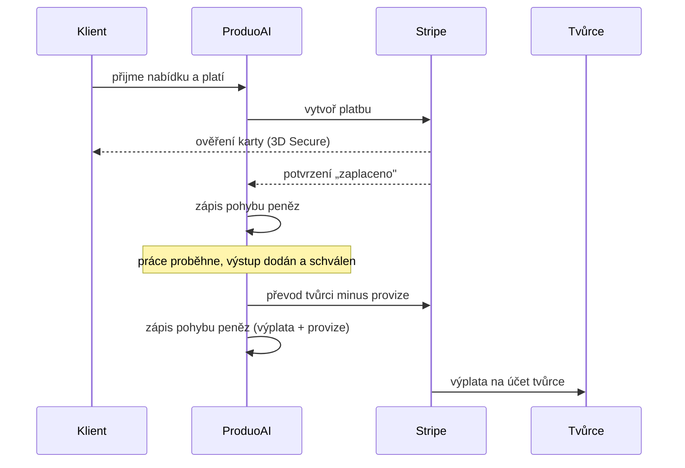

# 05 — Platby, provize, předplatné a escrow

## 1. Proč Stripe

Marketplace, který vybírá peníze od klienta, strhává provizi a vyplácí tvůrcům, nakládá s cizími prostředky. Provozovat to vlastními silami by v EU znamenalo řešit licenci platební instituce a přísná pravidla proti praní peněz. Proto využíváme **Stripe**, který platby zajišťuje pod vlastní licencí a navíc:

- **ověří totožnost tvůrce** (KYC — kontrola dokladů a bankovního účtu) pro účely výplat,
- **rozdělí platbu** (část tvůrci, část jako provize platformy),
- zajistí, že **číslo karty se nikdy nedostane na naše servery** (platební formulář hostuje Stripe) — tím se držíme v nejjednodušší úrovni pravidel pro placení kartou.

## 2. Zapojení Stripe

- **Tvůrci** jsou u Stripe připojené účty; registrace a ověření probíhá přes hostovaný formulář Stripe. Ukládáme pouze odkaz na jejich účet.
- **Platforma (ProduoAI)** vybírá platby, strhává provizi a odesílá výplaty.

## 3. Platba za zakázku (fáze 1)

Platforma vybere platbu a následně převede tvůrci část po odečtení provize.

Provize (%) je rozdíl mezi vybranou částkou a převodem tvůrci. Peníze se tvůrci posílají po schválení dodání.

## 4. Předplatné tvůrců

Měsíční/roční předplatné zajišťuje Stripe Billing (opakované platby, faktury). Kartu uchovává Stripe; my držíme pouze bezpečný odkaz, nikoli číslo karty. Model „paušál za přístup + provize ze zakázek" je běžný.

## 5. Escrow (zádržné) — fáze 2

Escrow znamená, že peníze klienta se podrží a tvůrci uvolní po dodání a schválení práce.

**Omezení k zohlednění:** Stripe formálně escrow účet nenabízí, ale umí peníze podržet a vyplatit později — **maximálně 90 dní**. Pro delší zakázky je proto potřeba vhodný model plateb.

### Dva modely plateb s milníky

**Model 1 — jedna platba předem, uvolňování po krocích.**
Klient zaplatí celou částku předem; ta se podrží a tvůrci se uvolňuje po částech, jak schvaluje jednotlivé kroky.
- Výhoda: tvůrce má jistotu, že prostředky na celou zakázku existují; jednodušší platba (jednorázová).
- Omezení: celá částka podléhá 90dennímu limitu od zaplacení — vhodné, pokud se celá zakázka vejde do 90 dní.

**Model 2 — platba krok po kroku.**
Klient platí každý krok, když se k němu dojde.
- Výhoda: každá platba má vlastní 90denní okno, takže model funguje i pro dlouhé zakázky; klient má platbu rozloženou.
- Omezení: klient může uprostřed odejít a další krok nezaplatit; platí opakovaně.

### Technologické varianty (platí pro oba modely)

| Varianta | Popis | Výhoda | Omezení |
|----------|-------|--------|---------|
| A) Podržení u Stripe | prostředky drženy u Stripe, uvolnění po schválení | zůstáváme u Stripe | limit 90 dní |
| B) Autorizace a pozdější stržení | platba se „zamluví" a strhne při schválení | méně držení prostředků | zámluva platí jen krátce |
| C) Specializovaný escrow (Mangopay, Lemonway) | peněženka s EU licencí, drží prostředky libovolně dlouho | escrow bez limitu | druhá platební integrace |

**Doporučení:** krátké zakázky (do ~90 dní) → Model 1, varianta A; dlouhé zakázky → Model 2, varianta A. Datový model má milníky připravené již nyní. K variantě C sáhneme jen při potřebě dlouhého držení prostředků v celku.

AI podpora escrow (automatická kontrola splnění kroku a upozornění na hrozící spor) je popsána v dok. 09b a 16 — inovací je právě rozhodovací AI vrstva, nikoli pohyb peněz.

## 6. Evidence peněz a kontrola

Každou událost od Stripe („zaplaceno", „vyplaceno") zapisujeme do interní evidence pohybů peněz. Zprávy se zpracovávají tak, aby opakované doručení nezpůsobilo dvojí zaúčtování. Evidenci pravidelně porovnáváme se Stripe; případný nesoulad vyvolá upozornění.

## 7. Fakturace a DPH

Faktury (provize, předplatné, výplaty) lze napojit na Fakturoid/iDoklad nebo generovat vlastními silami dle českých pravidel. Přeshraniční DPH u tvůrců v rámci EU doporučujeme konzultovat s daňovým poradcem; architektura pro to nechává rozhraní.

## 8. Bezpečnost plateb

Zprávy od Stripe se ověřují podpisem; platební akce se logují odděleně s delší dobou uchování; u každé platby se používá jednoznačný klíč pokusu proti dvojímu provedení.
