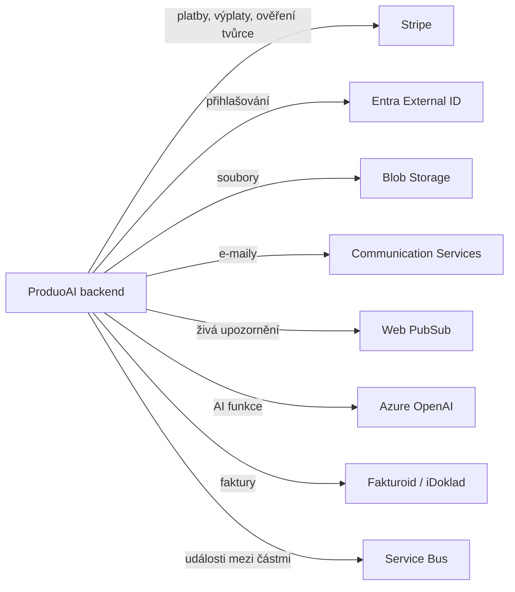

# 07 — Integrace (napojení na okolní služby)

Jak se naše aplikace napojí na externí služby a jak to udělat spolehlivě.

## 1. S čím se propojujeme

## 2. Dvě cesty, jak spolu části mluví

- **Hned (synchronně):** když uživatel na něco klikne a čeká odpověď (zobraz katalog, vytvoř objednávku). Prosté zavolání API.
- **Na pozadí (přes události):** co nemusí být hned (poslat e-mail, přepočítat skóre, spustit platbu). Vytvoří se **událost**, kterou později zpracuje worker. Výhoda: části aplikace nejsou na sobě natvrdo závislé a nic se neztratí.

**Zásada „překladače":** ke každé externí službě si napíšeme mezivrstvu, která její data přeloží do těch našich. Cizí formáty tak neprosáknou do jádra a když někdy Stripe/e-mail vyměníme, měníme jen tu mezivrstvu.

## 3. Jednotlivá napojení

### Stripe
- **My voláme Stripe:** vytvoř platbu, ulož kartu, založ předplatné, pošli výplatu, spusť ověření tvůrce.
- **Stripe volá nás (webhooky):** „platba proběhla", „předplatné se obnovilo", „výplata odešla". Tyhle zprávy ověříme podpisem a zpracujeme tak, aby opakování nevadilo (viz dok. 05).

### Entra External ID (přihlašování)
- Uživatel se přihlásí u Entra, my dostaneme potvrzení a spárujeme ho s naším účtem. Role (klient/tvůrce/admin) si řešíme u sebe.

### Blob Storage (soubory)
- Nahrávání jde přes **dočasný odkaz**, který vydá backend na konkrétní soubor a na krátkou dobu. Kontejnery nejsou veřejné.
- Po nahrání proběhne **antivirová kontrola**; výsledek se uloží k souboru.

### Communication Services + Web PubSub (notifikace)
- **E-maily:** potvrzení objednávky, změna stavu, faktura — přes připravené šablony.
- **Živá upozornění v aplikaci:** „nová nabídka", „změnil se stav zakázky", „nová zpráva".
- Uživatel si nastaví, co a kam chce dostávat.

### Azure OpenAI (AI funkce)
- Používáme na „otisky" textu pro párování a na pomocné funkce (viz dok. 09b). Region v EU, model se netrénuje na našich datech.

### Fakturoid / iDoklad
- Vystavování a evidence faktur. Konkrétní službu jde vyměnit, protože k ní máme překladač.

## 4. Jak navrhneme API

- **REST + popis (OpenAPI):** z popisu si frontend vygeneruje hotový, typově hlídaný klient → míň chyb.
- **Verzování** (`/v1`), jednotný formát chyb.
- **Klíč pokusu** u plateb, aby se operace neprovedla dvakrát.
- **Omezení počtu požadavků** (rate limit), aby nikdo aplikaci nezahltil.

## 5. Aby integrace byly odolné

- **Když externí služba selže, zkusíme to znovu** (s rostoucí pauzou). Co se opakovaně nepovede, jde stranou do „odkladiště" (dead-letter) k ruční kontrole.
- **Pojistka (circuit breaker):** když je Stripe/OpenAI dlouho nedostupný, dočasně to přestaneme zkoušet, ať nezahltíme sami sebe.
- **Rozumné limity čekání** a náhradní chování (např. když nejede párování, seřadíme tvůrce jednoduše podle hodnocení).
