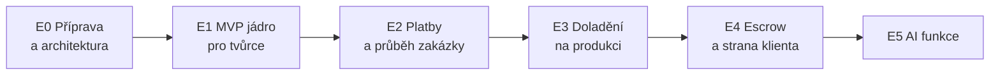

# 10 — Roadmapa (v jakém pořadí stavět)

## 1. Etapy v kostce

> AI funkce (E5) stavíme **variantou B** z hotových řešení (dok. 09b).

## 2. E0 — Příprava a architektura
- odsouhlasit rozhodnutí z dok. 00
- připravit cloud (základ v Azure), prostředí DEV, automatické nasazování
- **Hotovo, když:** schválená architektura a běžící DEV.

## 3. E1 — MVP jádro (nejdřív pro tvůrce)
- **Účty a role** (Entra, kdo co smí, profily klient/tvůrce)
- **Katalog** (služby, nabídky, kategorie, veřejné stránky pro Google, hledání)
- **Registrace tvůrce + ověření přes Stripe**
- **Soubory** (nahrávání zadání/podkladů/výstupů + antivirus)
- **Notifikace (základ)** — e-maily
- **Admin (základ)** — správa uživatelů, moderace
- **Hotovo, když:** tvůrci se registrují, publikují služby a katalog je veřejně k nalezení.

## 4. E2 — Platby a průběh zakázky
- **Objednávky a průběh** (stavy: poptávka → nabídka → objednávka → dodání → schválení)
- **Platby** (Stripe, provize, evidence pohybů peněz)
- **Předplatné** (měsíční/roční, uložení karty)
- **Fakturace** (napojení Fakturoid/iDoklad)
- **Notifikace (plné)** — živě stav zakázky
- **Hotovo, když:** projde celá zakázka včetně platby a předplatného.

## 5. E3 — Doladění na produkci
- **Sledování** (chyby, výkon, upozornění)
- **Bezpečnost** (penetrační test, kontrola dat, DPIA)
- **Zálohování a obnova** (vč. zkoušky obnovy)
- **Prostředí TEST/PROD** a nasazování bez výpadku
- **Dokumentace**
- **Hotovo, když:** je to nasaditelné, sledované, zálohované a zdokumentované.

## 6. E4 — Escrow a plná strana klienta (fáze 2)
- **Escrow** (podržení peněz, uvolnění po krocích; pozor na limit 90 dní), řešení sporů
- **Plná strana klienta** (rozšířené hledání, komunikace, opakované objednávky)
- **Další výdělek platformy** (např. success fee)
- **Hotovo, když:** fungují zakázky se zádržným a plná klientská strana.

## 7. E5 — AI funkce (varianta B, hotová řešení)
- **Párování** (Azure OpenAI + pgvector + vážený vzorec)
- **Trust Score** (průhledný vzorec)
- **Escrow AI nápověda** (pravidla + LLM jako rada člověku)
- **Analytika a doporučení cen**
- **Hotovo, když:** funkce běží a jsou vysvětlitelné.

## 8. Co jde dělat souběžně

- Kritická cesta k produkčnímu MVP je E0 → E1 → E2 → E3.
- **AI funkce (E5)** se dají rozjíždět **souběžně** už během E2/E3 (jsou z hotových nástrojů, takže jde hlavně o napojení), a doladit po E3/E4.

## 9. Hlavní milníky

| Milník | Kdy je splněný |
|--------|----------------|
| M1 — architektura schválena | odsouhlasená rozhodnutí, běží DEV |
| M2 — tvůrci onboardovaní | registrace + ověření Stripe + veřejný katalog |
| M3 — první placená zakázka | celý průběh + platba + provize |
| M4 — spuštění na produkci | E3 hotové, penetrační test, dokumentace |
| M5 — escrow spuštěn | podržení a uvolnění po krocích |
| M6 — AI funkce naživo | párování, skóre, doporučení cen |

> Konkrétní časování (v týdnech) je uvedeno v dok. 11 podle velikosti realizačního týmu.
