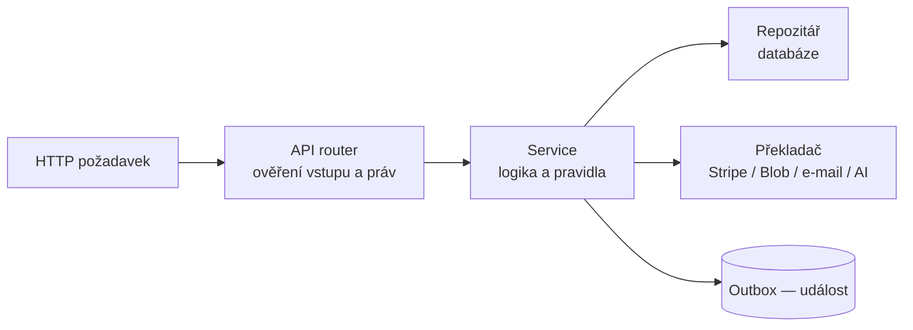
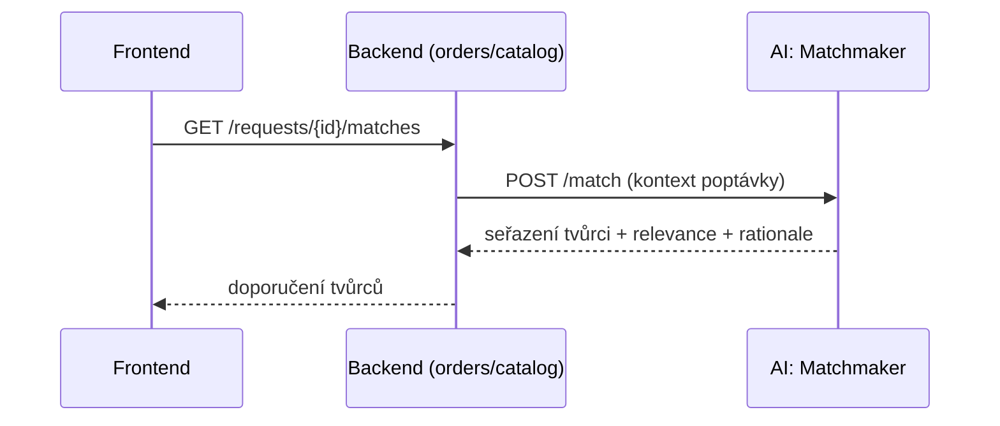
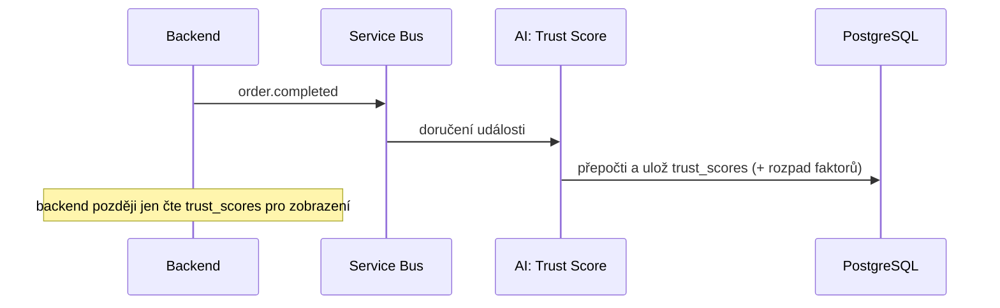

# 13 — Architektura backendu (endpointy, propojení s AI, struktura kódu)

Backend je **Python + FastAPI**, jeden nasaditelný celek (modulární monolit) rozdělený na moduly + **oddělené AI služby** (párování, Trust Score, analytika — dok. 16).

## 1. Vrstvy uvnitř backendu

Každý požadavek prochází třemi vrstvami — díky tomu je kód přehledný a testovatelný:

1. **API vrstva (router)** — přijme HTTP požadavek, ověří vstup (Pydantic) a přihlášení/oprávnění, zavolá službu.
2. **Service vrstva (logika)** — vlastní pravidla (např. „objednávku smí zaplatit jen její klient a jen ve stavu PRIJATA"). Volá databázi a externí služby přes repozitáře/klienty.
3. **Data vrstva (repozitáře)** — čtení/zápis do databáze (SQLAlchemy) a práce s externími službami přes „překladače" (Stripe, Blob, e-mail, AI).



## 2. Endpointy pro frontend — rozšířené specifikace

Formát: co dělá · co posílá (tělo) · co vrací. Vše pod `/v1/...`, chyby jednotně (problem+json), u plateb „klíč pokusu".

### Účty a profily
- **`GET /me`** — kdo jsem. · vrací: profil, role, stav onboardingu.
- **`GET /creators/{id}`** — veřejný profil tvůrce. · vrací: profil, služby, portfolio, hodnocení, Trust Score (s rozpadem).
- **`PATCH /creators/me`** — úprava profilu tvůrce. · posílá: bio, skills, languages, capacity_status. · vrací: aktualizovaný profil (na pozadí se přepočítá „otisk" profilu).
- **`POST /creators/me/stripe-onboarding`** — spustí ověření přes Stripe. · vrací: odkaz na hostovaný formulář Stripe.

### Katalog
- **`GET /catalog/services`** — seznam služeb. · parametry: `category`, `min_price`, `max_price`, `min_rating`, `q` (hledání), `sort`, `page`. · vrací: stránkovaný seznam + počet.
- **`GET /catalog/services/{id}`** — detail služby. · vrací: službu, varianty (tiers), ukázky, tvůrce.
- **`POST /catalog/services`** — nová služba (tvůrce). · posílá: title, description, category_id, tiers[] (name, price, delivery_days, revisions). · vrací: vytvořenou službu (`status=draft`); na pozadí se spočítá „otisk".
- **`PATCH /catalog/services/{id}`** — úprava / publikace. · posílá: měněná pole, `status`.
- **`GET /categories`** — strom kategorií.

### Poptávky, nabídky, objednávky
- **`POST /requests`** — nová poptávka (klient).
  - **posílá:** `title`, `brief`, `category_id`, `budget`, `currency`, `deadline`.
  - **dělá:** uloží poptávku (`status=published`); vydá událost `request.created` → AI párování si spočítá „otisk" a připraví doporučení.
  - **vrací:** poptávku (`id`, `status`).
- **`GET /requests/{id}`** — detail poptávky. · vrací: poptávku + došlé nabídky.
- **`GET /requests/{id}/matches`** — doporučení tvůrců (klient).
  - **dělá:** zavolá **AI párování** (viz sekce 3).
  - **vrací:** seřazené tvůrce s `relevance` a `rationale` (vysvětlením).
- **`GET /requests/matched`** — poptávky vhodné pro mě (tvůrce). · vrací: seznam z pohledu tvůrce (opačný směr párování).
- **`POST /quotes`** — poslat nabídku (tvůrce). · posílá: `request_id`, `price`, `currency`, `delivery_days`, `message`. · vrací: nabídku (`status=sent`); klientovi upozornění.
- **`POST /orders`** — vytvořit objednávku z přijaté nabídky. · posílá: `quote_id`. · dělá: založí objednávku (`state=PRIJATA`), volitelně milníky. · vrací: objednávku.
- **`GET /orders/{id}`** — detail zakázky. · vrací: stav, milníky, výstupy, soubory, zprávy.
- **`GET /orders?role=client|creator`** — moje zakázky. · vrací: seznam podle role.
- **`POST /orders/{id}/pay`** — zaplatit (klient). · dělá: založí platbu ve Stripe. · vrací: `client_secret` pro potvrzení karty; po potvrzení (webhook) → `state=PROBIHA`.
- **`POST /orders/{id}/deliverables`** — nahrát výstup (tvůrce). · posílá: `title`, `file_asset_ids[]`. · vrací: výstup (`status=delivered`); klientovi upozornění.
- **`POST /orders/{id}/approve`** — schválit dodání (klient). · posílá: volitelně `milestone_id`. · dělá: spustí výplatu (transfer) tvůrci minus provize + zápis pohybů peněz; vydá `order.completed` → přepočet Trust Score. · vrací: aktualizovanou zakázku.
- **`POST /orders/{id}/messages`** — zpráva v zakázce. · posílá: `body`. · vrací: zprávu.

### Soubory
- **`POST /files/upload-url`** — vyžádá dočasný odkaz pro nahrání do Blobu. · posílá: `kind`, `content_type`, `size`. · vrací: `upload_url`, `file_asset_id`.
- **`GET /files/{id}/download-url`** — dočasný odkaz pro stažení.

### Platby a fakturace
- **`GET /billing/subscription`** / **`POST /billing/subscription`** — předplatné tvůrce. · posílá: `plan` (monthly/yearly). · vrací: stav předplatného.
- **`POST /billing/payment-method`** — uložit kartu (Stripe SetupIntent). · vrací: `client_secret`.
- **`GET /billing/invoices`** / **`GET /billing/payouts`** — faktury / výplaty.

### Notifikace
- **`GET /notifications`**, **`PATCH /notifications/{id}/read`**, **`GET/PATCH /notifications/preferences`**.

### Webhooky (volá Stripe)
- **`POST /webhooks/stripe`** — příchozí zprávy od Stripe (ověřené podpisem, zpracované tak, aby opakování nevadilo).

### Admin
- **`GET /admin/metrics`**, **`GET/PATCH /admin/users`**, **`GET /admin/orders`**, **`GET/PATCH /admin/disputes`**.

## 3. Propojení backendu s AI službami

AI služby (párování, Trust Score, analytika, případně escrow-pomocník) jsou **samostatné aplikace** (dok. 16). Backend s nimi mluví **dvěma způsoby**:

### a) Synchronně (na vyžádání, „zeptej se a počkej")
Když uživatel něco chce hned. Interní REST volání uvnitř privátní sítě (autentizace mezi službami přes spravovanou identitu / interní token).



Synchronně se volá: **párování** (`POST /match`), **doporučení ceny** (`GET /intelligence/price-suggestion`), **kontrola milníku** u escrow-pomocníka (`POST /escrow-ai/check-milestone`).

### b) Asynchronně (na pozadí, přes události ze Service Bus)
Když se něco stalo a AI si má něco přepočítat — uživatel na to nečeká. Backend vydá událost, AI služba ji odebírá.

| Událost z backendu | Kdo ji odebírá | Co udělá |
|--------------------|----------------|----------|
| `request.created`, `service.updated`, `creator.updated` | Matchmaker | spočítá „otisk" (embedding) a uloží do DB |
| `order.completed`, `review.created`, `message.created` | Trust Score | přepočítá skóre dotčeného uživatele |
| `order.completed`, `payment.settled` | Intelligence | aktualizuje souhrnné metriky |



### c) Sdílení dat
- AI služby mají **jen pro čtení** přístup k potřebným tabulkám jádra (profily, objednávky, hodnocení) a **zapisují do vlastních AI tabulek** (`trust_scores`, `match_results`, `creator_match_features` — dok. 04).
- Backend AI tabulky **jen čte** pro zobrazení (např. Trust Score na profilu). Nikdy je nepřepisuje — o to se stará příslušná AI služba.
- Tím je hranice čistá: kdo co zapisuje je jednoznačné, a AI se dá kdykoli škálovat/nasazovat zvlášť.

## 4. Struktura kódu (jádro)

```
apps/api/
├─ app/
│  ├─ main.py                  # start aplikace, připojení rout
│  ├─ core/                    # nastavení, přihlášení, chyby, logování
│  ├─ db/                      # připojení k DB, session, base modely
│  ├─ modules/                 # doménové moduly (kopírují dok. 01)
│  │  ├─ identity/
│  │  │  ├─ router.py          # API vrstva
│  │  │  ├─ service.py         # logika
│  │  │  ├─ repository.py      # databáze
│  │  │  ├─ models.py          # tabulky (SQLAlchemy)
│  │  │  └─ schemas.py         # vstupy/výstupy (Pydantic)
│  │  ├─ catalog/
│  │  ├─ orders/
│  │  ├─ files/
│  │  ├─ payments/
│  │  ├─ notifications/
│  │  └─ admin/
│  ├─ integrations/            # překladače na externí služby
│  │  ├─ stripe/
│  │  ├─ blob/
│  │  ├─ email/
│  │  └─ ai/                   # klienti pro volání AI služeb (match, price…)
│  ├─ events/                  # outbox, publikování a zpracování událostí
│  └─ workers/                 # úlohy na pozadí (e-maily, přepočty)
├─ migrations/                 # změny databáze (Alembic)
└─ tests/
```

**Zásady:**
- **Jeden modul = jedna složka** se stejnými soubory → snadná orientace.
- **Moduly nesahají do cizích tabulek** — volají se přes service vrstvu nebo přes události.
- **Externí služby jen přes `integrations/`** — včetně `integrations/ai/` pro volání AI služeb.

## 5. Testování

- **Unit testy** service vrstvy (pravidla).
- **Integrační testy** endpointů proti testovací databázi.
- **Kontraktní kontrola** — vygenerovaný typový klient pro frontend i klienti pro AI služby odpovídají jejich popisu (OpenAPI).
- Testy běží automaticky v CI (dok. 03) před nasazením.
