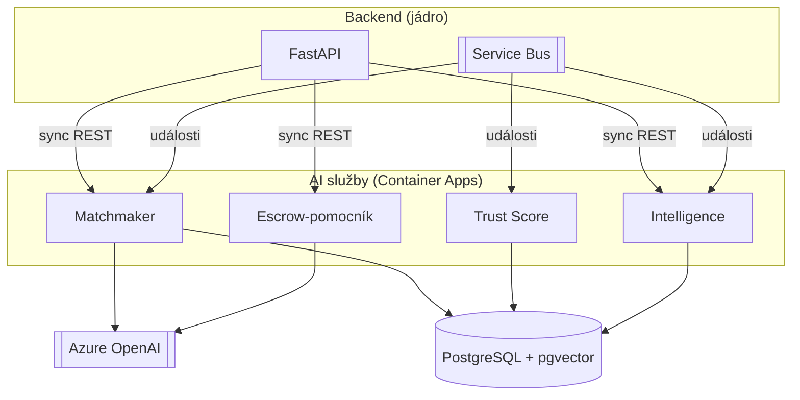
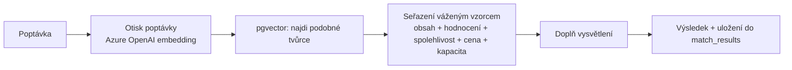
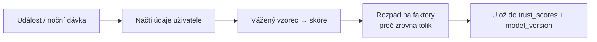

# 16 — Architektura jednotlivých AI služeb

Tento dokument popisuje, **jak jsou postavené** jednotlivé AI služby (co dovnitř, co ven, čím se spouští, kde běží). Navazuje na dok. 09b (co dělají a z jakých dat) a na dok. 13 (jak se s nimi backend baví). Vše je ve variantě B — **hotová řešení**, žádné vlastní výzkumné modely.

## 1. Společný základ všech AI služeb

Každá AI služba je **samostatná malá FastAPI aplikace** ve složce `apps/ai/<služba>` (dok. 14), nasazená jako vlastní kontejner v Azure Container Apps. Sdílejí stejný vzor:

- **Vstup dvěma cestami:** synchronně přes vlastní REST (backend „se zeptá"), nebo asynchronně přes události ze Service Bus (přepočet na pozadí).
- **Přístup k datům:** jen pro čtení k potřebným tabulkám jádra; zápis jen do vlastních AI tabulek (dok. 04).
- **Sledování:** stejné logování a metriky (Application Insights) jako jádro.
- **Verzování:** u každého výstupu se ukládá `model_version` (u nás „verze vzorce/nastavení") → dohledatelnost kvůli pravidlům o AI (dok. 06).

---

## 2. Matchmaker (párování)

**Co dělá:** ke každé poptávce vrátí seřazené vhodné tvůrce s vysvětlením (dok. 09b, funkce 1).

**Spouští se:**
- **Synchronně** — `POST /match` (backend při `GET /requests/{id}/matches`).
- **Asynchronně** — události `request.created`, `service.updated`, `creator.updated` → přepočet „otisků" (embeddings).

**Vstupy (data):** text poptávky (brief, kategorie), „otisky" tvůrců a služeb (pgvector), strukturované údaje tvůrce (ceny, `rating_avg`, `completion_rate`, `on_time_rate`, `capacity_status`).

**Vnitřní tok:**

**Výstupy:** seřazení tvůrci (`relevance`, `rationale`), uložené do `match_results`; „otisky" do `services.embedding` / `creator_profiles.embedding`.

**Endpointy:** `POST /match` (kontext poptávky → seřazení), `POST /embeddings/recompute` (interní, spouštěné událostí).

**Technologie:** Azure OpenAI (embeddings), pgvector, vážený vzorec v Pythonu.

---

## 3. Trust Score (skóre důvěryhodnosti)

**Co dělá:** spočítá vysvětlitelné skóre tvůrce i klienta (dok. 09b, funkce 2).

**Spouští se:**
- **Asynchronně** — události `order.completed`, `review.created`, `message.created` → přepočet skóre dotčeného uživatele.
- **Dávkově** — noční přepočet všech (plánovaná úloha).
- (Sync endpoint není nutný — backend jen čte hotové skóre z tabulky.)

**Vstupy (data):** `rating_avg`/`rating_count`, `completion_rate`, `on_time_rate`, `avg_response_hours`, podíl sporů, stáří účtu, počet zakázek (dok. 09b upřesňuje přesná pole).

**Vnitřní tok:**

**Výstupy:** `trust_scores` (skóre + `factors` + `model_version`). Žádné automatické blokace — sankce vždy potvrzuje člověk (dok. 06).

**Endpointy:** interní `POST /recompute` (spouštěné událostí/dávkou). Čtení řeší jádro přímo z tabulky.

**Technologie:** čistý Python (vážený vzorec), plánovač pro noční dávku. Žádný trénovaný model — záměrně, kvůli spravedlnosti a vysvětlitelnosti.

---

## 4. Intelligence (analytika a doporučení cen)

**Co dělá:** doporučení ceny a přehledy o výkonu marketplace (dok. 09b, funkce 4).

**Spouští se:**
- **Synchronně** — `GET /intelligence/price-suggestion` (backend při zakládání poptávky/nabídky).
- **Dávkově** — pravidelná agregace metrik a (volitelně) předpověď poptávky.

**Vstupy (data):** kategorie, ceny a lhůty z `service_tiers`, částky a výsledky z `orders`, hodnocení z `reviews` — **v souhrnu** (agregovaně, bez zbytečné práce s osobními údaji).

**Vnitřní tok:**
- *Doporučení ceny:* medián a rozpětí cen podobných minulých zakázek (kategorie + rozsah) → doporučené pásmo.
- *Přehledy:* předpočítané metriky (počty, obrat, konverze) do tabulky `metric_snapshot`; volitelně slovní shrnutí přes Azure OpenAI.
- *Předpověď poptávky (volitelně):* knihovna **Prophet** nad historií (dok. 09b).

**Výstupy:** doporučené cenové pásmo (sync), souhrnné metriky (dávka) pro admin dashboard.

**Endpointy:** `GET /intelligence/price-suggestion`, `GET /intelligence/metrics`.

**Technologie:** statistika v Pythonu (pandas), Prophet pro předpovědi, volitelně Azure OpenAI pro slovní shrnutí.

---

## 5. Escrow-pomocník (volitelný, fáze 2)

**Co dělá:** radí člověku, jestli je krok hotový a jestli nehrozí spor (dok. 09b, funkce 3). **Nerozhoduje o penězích** — jen připraví doporučení.

**Spouští se:** **synchronně** — `POST /escrow-ai/check-milestone` (backend při nahrání výstupu / před schválením kroku).

**Vstupy (data):** text zadání (`brief`), popis kroku (`milestones.title`), popis a metadata výstupů (`deliverables`, `file_assets`), komunikace u zakázky (`order_messages`) pro odhad hrozícího sporu.

**Vnitřní tok:** jazykový model (Azure OpenAI) porovná výstup se zadáním → připraví doporučení („bod 2 zadání zřejmě chybí") + míru jistoty. Výsledek jde člověku ke schválení.

**Výstupy:** doporučení + zdůvodnění (nikoli automatická akce).

**Technologie:** Azure OpenAI.

---

## 6. Shrnutí spouštění a výstupů

| Služba | Sync endpoint | Async událost | Dávka | Píše do |
|--------|---------------|---------------|-------|---------|
| Matchmaker | `POST /match` | otisky při změně | — | `match_results`, `*.embedding` |
| Trust Score | — | při dokončení/hodnocení | noční přepočet | `trust_scores` |
| Intelligence | `price-suggestion`, `metrics` | metriky při událostech | agregace, předpověď | `metric_snapshot` |
| Escrow-pomocník | `check-milestone` | — | — | (nic — jen vrací doporučení) |

Všechny služby jsou **oddělené, škálovatelné zvlášť a vysvětlitelné**. Pokud by se někdy šlo do dotace (varianta A, dok. 09), tato struktura se dá nadstavit o trénované modely a měření novosti bez přestavby jádra.
